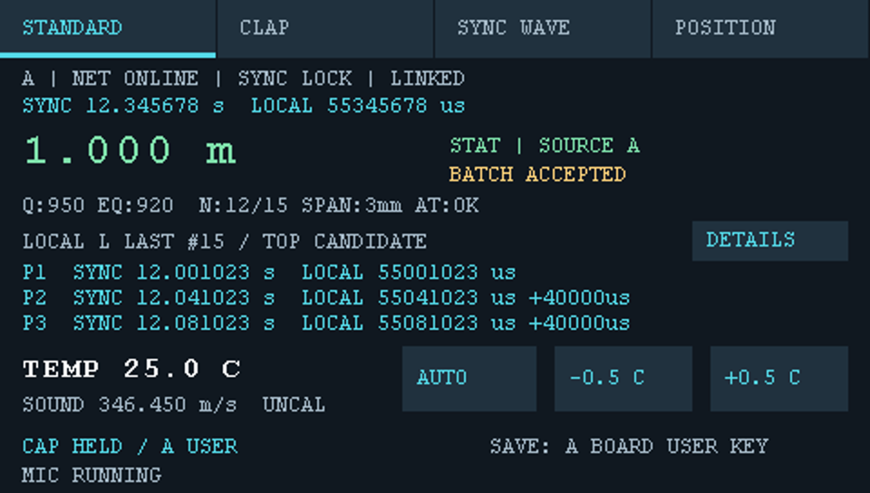
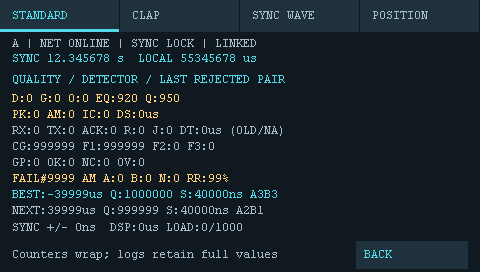
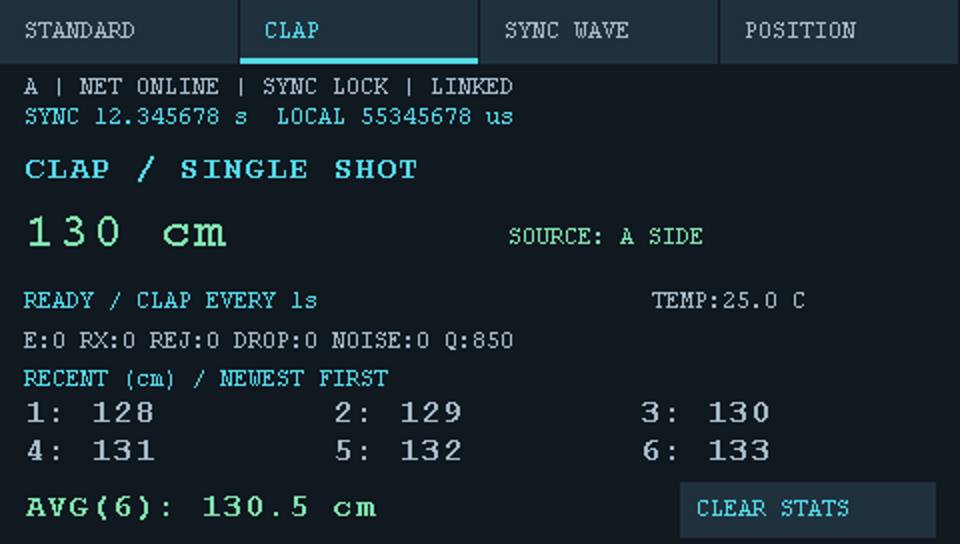
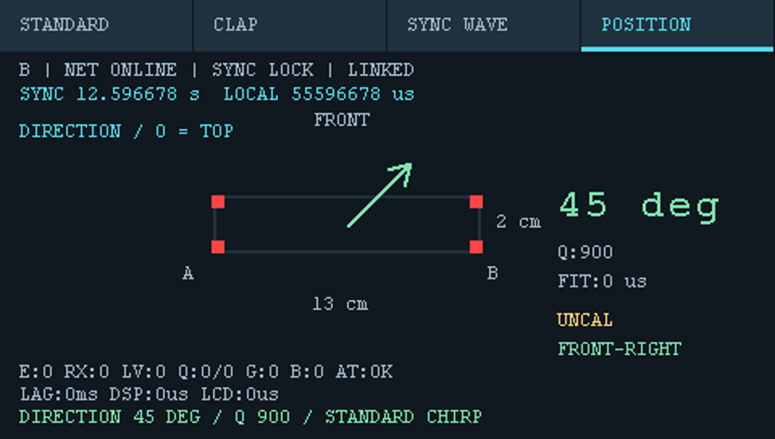

# 双开发板声学测距系统使用说明书

更新日期：2026-10-02。适用于当前四选项卡触摸UI及48 kHz、LEGACY/JOINT2固件。本文按准备与页面导航、标准音频测距、击掌测距、波形显示、声源定位五个板块组织；四个页面分别说明操作流程和参数含义。工程概况见[README](README.md)，开发与验证记录见[commit_logs](commit_logs/)。

**目录**

文中的界面图片引用自`commit_logs/assets/`，用于说明布局与字段位置，属于主机渲染/模拟输入预览，不作为实机测量结果。历史预览中的数值、计数及部分提示可能与当前固件不同，操作和参数以本文说明为准。

- [1. 准备与页面导航](#1-准备与页面导航)
- [2. 标准音频测距](#2-标准音频测距)
- [3. 击掌测距](#3-击掌测距)
- [4. 波形显示](#4-波形显示)
- [5. 声源定位](#5-声源定位)

## 1. 准备与页面导航

### 1.1 硬件与连接准备

两板分别运行对应A/B固件，接通电源并连接以太网。观察顶部角色与`NET ONLINE`，等待`SYNC LOCK`和`LINKED`。需要保存测距录音时，给A板插入FAT/FAT32格式SD卡；波形页仅实时观测，不需要为此插卡。

### 1.2 命令行编译A/B固件

打开PowerShell，进入工程根目录。以下命令使用本机工程路径；在其他电脑上替换为实际位置：

```powershell
Set-Location 'E:\IARprojects\STM32CubeF7_cut\Project\ranging_bsp'
```

当前使用IAR Embedded Workbench 8.2，脚本默认编译器路径为`C:/Program Files (x86)/IAR Systems/Embedded Workbench 8.2/common/bin/IarBuild.exe`。运行以下命令，编译48 kHz、LEGACY/JOINT2的A/B两份固件：

```powershell
powershell -NoProfile -ExecutionPolicy Bypass -File tools/build_range_profiles.ps1 -SampleRate 48000 -Profiles legacy -JointPeaks
if ($LASTEXITCODE -ne 0) { throw 'A/B build failed' }
```

脚本依次生成A/B角色配置并编译，无需手动改头文件，也没有单独的`-Board`选项。保留`-JointPeaks`才能得到本文使用的联合候选配置；如IAR安装路径不同，在命令末尾添加`-IarBuild '实际路径/IarBuild.exe'`。

脚本使用全量构建，统一工程及文件/组级覆盖中的角色、采样率和方案宏，并检查每条实际C编译命令。确认输出包含两次编译成功及`verified ... compiler commands`；任一模块参数不一致会报错并停止。完整日志位于`EWARM/ranging_legacy_joint_A_48000/List/build.log`和`EWARM/ranging_legacy_joint_B_48000/List/build.log`。

确认两次构建均成功后，检查`EWARM/ranging_bsp/Exe/`中的产物：

| 对应板 | 调试/烧录文件 | HEX文件 |
| --- | --- | --- |
| A | `ranging_legacy_joint2_A_48000Hz.out` | `ranging_legacy_joint2_A_48000Hz.hex` |
| B | `ranging_legacy_joint2_B_48000Hz.out` | `ranging_legacy_joint2_B_48000Hz.hex` |

使用本次构建的产物，避免将旧固件当作新版本。两板使用同一源码版本和配置，分别烧入对应角色固件；当前48 kHz协议版本为12。

### 1.3 命令行分别烧录两板

1. 用USB将两板的ST-LINK连接电脑，确认A/B与探针对应关系。需要录音保存时，A为插SD卡的板。
2. 在同一个工程根目录执行下面的PowerShell代码。配置文件已启用下载校验；每次下载成功后自动启动对应板，失败则停止并报错。
3. 两次调用均成功后，连接两板以太网，检查屏幕角色分别为A/B，等待`NET ONLINE`、`SYNC LOCK`、`LINKED`；进入标准测距时再确认`AT:OK`。

| 对应板 | ST-LINK完整序列号 | 命令使用的短号 |
| --- | --- | --- |
| A | `0675FF514966504867230834` | `67230834` |
| B | `0667FF485153826687134138` | `87134138` |

```powershell
$cspy = 'C:/Program Files (x86)/IAR Systems/Embedded Workbench 8.2/common/bin/CSpyBat.exe'
$general = (Resolve-Path 'EWARM/settings/ranging_bsp.ranging_bsp.general.xcl').Path
$driver = (Resolve-Path 'EWARM/settings/ranging_bsp.ranging_bsp.driver.xcl').Path
function Flash-RangeBoard([string]$Board, [string]$Probe) {
    $firmware = (Resolve-Path "EWARM/ranging_bsp/Exe/ranging_legacy_joint2_${Board}_48000Hz.out").Path
    & $cspy -f $general "--debug_file=$firmware" --download_only --leave_target_running --silent --timeout 60000 --backend -f $driver "--drv_communication=USB:#$Probe"
    if ($LASTEXITCODE -ne 0) { throw "Board $Board download failed" }
}
Flash-RangeBoard 'A' '67230834'
Flash-RangeBoard 'B' '87134138'
```

上述序列号为本项目现有探针映射，不按USB枚举顺序分配角色。换电脑或探针时，核对IAR路径、序列号及两个`.xcl`配置文件中的本机绝对路径，再执行。

### 1.4 页面导航

| 选项卡 | 用途 | 使用要点 |
| --- | --- | --- |
| `STANDARD` | 标准三脉冲音频测距，显示结果、到达时刻、质量与诊断 | 按A板实体USER键保存录音 |
| `CLAP` | 击掌单次测距 | 共线外侧击掌，显示距离cm及声源A/B侧 |
| `SYNC WAVE` | 每板显示本板L麦克风实时波形 | 暂停标准测距，不提供保存 |
| `POSITION` | 13×2 cm矩形四麦声源方向 | A显示摆放示意，B显示方向；使用专用扫频，不保存 |

触摸任意一板的顶部选项卡，两板联动切页；切到非STANDARD页面暂停测距。设置等待确认或保存事务未结束时不能切页。`DETAILS`和`BACK`只改变本板的测距详情视图，不联动对端，也不停止测距。正常切页不清零顶部共同同步计数；失去同步时计数归零。

## 2. 标准音频测距



图2-1：STANDARD主页面预览，包含AUTO入口、手动温度按钮、三脉冲到达时刻与保存状态。

### 2.1 操作流程

1. 进入`STANDARD`。两板指定L麦克风近似共线，声源位于两板外侧，距近端指定麦克风约0.5～1 m。测量原理是声程差，其他几何布局下显示值不一定等于板间距离。
2. 用`-0.5 C`、`+0.5 C`设置现场温度，两板会同步更新。等待`SYNC LOCK`、`LINKED`和`AT:OK`；要录音时还需确认`CAP ARM`。
3. 播放[标准48 kHz三脉冲重复测试音](tools/audio/generated/standard_repeat_48000hz_15p5s.wav)一次，完整音频约15.5秒。500 Hz连续正弦波用于波形页，不替代测距签名音。
4. 先观察`SINGLE`单次预览，再观察约11秒统计窗口结束后的`STAT`和批次结论；同时检查`N`、`SPAN`、方向及质量。必要时触摸`DETAILS`查看拒绝原因与计数。
5. 需要保存时，等`CAP HELD / A USER`后按A板实体蓝色USER键。等待保存及双板恢复完成、重新同步后，再播放下一轮。保存失败可保留本轮并在排除问题后重试。

完整保存目录包含`A.RNG`、`B.RNG`、`COMPLETE.TXT`；PC端解码操作和产物见[2.3节](#23-pc端数据解码与产物)，保存边界与故障处理见[2.1.1～2.1.2节](#211-录音边界与取卡)。温度重启恢复25°C，目前不掉电保存。

#### 2.1.1 录音边界与取卡

A板使用FAT/FAT32格式SD卡，不支持exFAT，程序不会格式化卡。正常流程等播放结束且`CAP HELD / A USER`后，短按A板蓝色USER键（不是黑色RESET键）；保存中保持网线连接，先写A文件，再传输并写B文件，期间暂停测量和时钟同步处理。完成双板RESET/ARM恢复后，等待`SYNC LOCK`、`LINKED`、`AT:OK`再播放下一轮。

每板环形录音最多保留16秒。任一板识别标准签名后，继续录12秒并自动冻结，保留触发前最多4秒；按键稍晚不会用静默覆盖已冻结的声音。此机制面向当前约10.5秒内容的测试音，不适用于任意更长录音，也不要在保存前重复播放。

若两板整轮都未识别、始终显示`CAP ARM`，USER键会冻结并保存最近16秒；应在播放结束后立即按键，避免后续静默覆盖。提前按键会提前冻结，因此正常测量应等完整播放结束。

确认不再显示保存进度后取卡，将整轮`Rxxxxxx`目录复制到PC，另行记录真值、播放侧、遮挡路径、音频/固件版本和温度；继续测量前重新插卡。每轮标准录音通常合计约6.2 MB。只将含有有效`COMPLETE.TXT`且通过解码校验的目录作为完整一轮，不完整目录保留供恢复。

#### 2.1.2 保存失败与恢复

`CAP ERR n / RETRY`表示失败后保留本轮，修复卡或网络问题后再次短按A USER重试。重试会创建新目录，不覆盖旧轮；尚未保存的RAM数据会在掉电/复位后丢失。任一板复位改变会话后，不能拼接旧轮与新轮。

| 状态/错误 | 判断与处理 |
| --- | --- |
| 1xx / 199 | 文件写入失败；199为空间不足等短写，检查剩余空间。 |
| 2xx / 3xx / 4xx / 5xx | 文件关闭 / 打开 / 挂载 / 创建目录失败；末两位通常为FatFs错误码。 |
| 403 / 413 | 无卡常见403；exFAT或无有效FAT文件系统常见413，确认卡格式及连接。 |
| 902 / 904 | 等待B冻结 / 接收B数据超时，检查两板供电与网线。 |
| `CAP NEED PEER` | 对端网络未就绪，等待通信恢复。 |
| `CAP PEER RESET` / 901 | 对端会话改变，保留已有文件并重新开始两板测试。 |
| `CAP SAVED / RESET B`、`ARM B` | 文件已写完，仍在清零/恢复握手；先检查网线并等待，不要播放下一轮。 |
| `CAP SEND TO A` | B保留本轮并等待A完成传输/保存，结合A板状态排查。 |

底层SD诊断须与CAP错误码一起记录，例如`SD W H1 E00000010`：

| 字段 | 含义 |
| --- | --- |
| `W/R`、`B`、`I/D`、`N` | DMA写/读、等待卡就绪、SD/DMA初始化、未检测到卡。 |
| `H1` / `H2` / `H3` | HAL状态：错误 / 忙 / 超时。 |
| `E00000010` | 发送FIFO欠载。 |
| `E00000020` | 接收溢出。 |
| `E00000002` | 数据CRC错误。 |

首个底层错误会在终止传输/关闭文件前锁存，下次挂载重试时清除；请同时拍摄两板状态与完整错误行，避免只保留一个错误码。

### 2.2 参数说明

本节说明STANDARD主页面和DETAILS详情视图，默认48 kHz、LEGACY/JOINT2。`s`为秒，`us`为微秒，`ns`为纳秒，`mm`为毫米。屏幕混合显示当前状态、最近测量快照和累计计数，**并不是所有数字都属于同一个事件或同一时刻**。DETAILS仅切换本板的详情视图，BACK返回首页，不停止测距。

#### 2.2.1 顶部身份、连接与时钟

| 显示 | 含义与判断 |
| --- | --- |
| `A` / `B` | 当前板角色。A负责跨板配对、距离/统计发布和SD写入；B发送自己的检测事件并显示A的结果。 |
| `NET ONLINE` / `NET WAIT` | 双板业务连接在线 / 等待对端；不是仅表示网线已插入。 |
| `SYNC LOCK` / `SYNC WAIT` | 时钟模型已锁定 / 尚未锁定或已失锁；应等LOCK再正式测量。 |
| `SYNC PAUSE` | 保存事务暂停时钟同步处理；通常同时显示SAVING，不等于网络故障。 |
| `LINKED` | 当前两板设置已完成所需确认，可以继续操作。它表示设置联动就绪，不代替SYNC LOCK。 |
| `SETTINGS WAIT` | 离线、等待A下发设置或等待设置确认；此时不接受新的切页/调温操作，测距也暂停。 |
| `SAVING` | 录音保存、恢复握手或保留待重试事务正在占用业务流程；切页/调温禁用。 |
| `TOUCH ERROR` | 触摸初始化/读取失败或读操作过慢，触摸轮询已停用；重启后重新初始化，持续出现则检查硬件。该提示优先于LINKED/SAVING显示。 |
| 顶部 `SYNC 581.379445 s` | 当前共同同步计数：两板以A指定的共同整秒起点计数，小数六位为微秒。失锁、起点未就绪或保存暂停时显示0；正常切页/调温不清零。 |
| 顶部 `LOCAL ... us` | 当前本板硬件时钟读数，单位微秒，独立本地纪元。它不是日期时间，不因同步计数归零而清零；不能直接将A/B的LOCAL值相减作为声程差。 |

两张不同时刻拍摄的照片，顶部SYNC计数不同是正常的；比较同步精度需要同时观测或读取匹配的事件记录。

#### 2.2.2 距离、方向、批次与质量摘要

| 显示 | 含义与判断 |
| --- | --- |
| 大号 `0.129 m` | 当前结果的距离绝对值，显示分辨率1 mm；分辨率不代表测量精度。系统测的是声程差，声源在板外侧且与指定L麦克风近似共线时才近似板间距离。 |
| `--.--- m` | 当前没有可显示的有效结果，例如等待、过期、失锁、设置尚未确认等。 |
| `SINGLE` | 一次有效跨板配对的预览，通常黄色；不是整轮统计结果。 |
| `STAT` | 整轮统计通过，通常绿色；稳定统计也可能对应错误回波，不能仅凭绿色认定真值正确。 |
| `EXPIRED` / `WAIT` / `INVALID` | 旧结果当前不可显示 / 等待结果 / 结果被标记无效。有效期为新结果发布后15秒，重绘不会续期；失锁/设置未就绪也会使结果不可显示。 |
| `SOURCE A` / `SOURCE B` | 判定声音从A侧 / B侧到达；不是当前显示板的身份。`?`为方向不确定，`--`为无有效方向。 |
| `WAITING FOR SOUND` | 暂无进行中的统计批次。 |
| `BATCH COLLECTING / 11s` | 从本轮首个配对事件起收集，统计窗口约11秒；与单次结果显示延迟是两回事。 |
| `BATCH ACCEPTED` | 统计批次通过。当前需至少6个入选样本、入选比例至少60%且严格超过一半，簇跨度≤40 mm，统计中心在100～2000 mm。 |
| `BATCH TOO FEW` | 本轮配对样本不足。 |
| `BATCH UNSTABLE` | 样本形成的有效簇未满足数量/占比/跨度等要求。 |
| `BATCH OUT OF RANGE` | 统计中心超出当前100～2000 mm范围；不能据此判断物理声源一定在范围外，错峰也可能造成超范围。 |
| `LAST / PEAK UNCERTAIN` | 最近一次候选提取/配对出现不确定性，当前大号值若仍可见，是尚未过期的旧结果；不能把它当作刚刚失败事件的新结果。 |
| 摘要 `Q` | 距离结果的质量，0～1000。单次为选中A/B候选质量的较小值；STAT为入选统计样本质量的最小值。不是准确率百分比，也不直接等于误差。无新结果时可能保留旧值或为0。 |
| `EQ` | 本板最近检测事件的相关质量，0～1000，按签名中较弱脉冲的相关值换算。A/B拾音不同，EQ不必相同；也不必等于最终候选或统计Q。默认LEGACY候选最低质量门限为300。 |
| 摘要 `N:15/15` | 统计入选样本数 / 本轮累计配对样本数，最多15条。收集中分子/跨度可能尚未计算，不能把暂时0/N当作最终全被拒绝。 |
| `SPAN:1mm` | 入选距离簇的最大值减最小值，单位mm；不是标准差，不是对真值的绝对误差。 |
| `AT:OK` / `AT:WAIT` | 本板音频样点到硬件时间的拟合已就绪 / 尚未就绪。这与两板网络时钟SYNC是不同环节。 |

一轮失败时可能保留上一次单次/统计结果，同时显示当前批次失败原因；应同时读结果类型、批次提示及有效期。两板Q一致而EQ不同正常。

#### 2.2.3 三个脉冲的到达时刻

| 显示 | 含义与判断 |
| --- | --- |
| `LOCAL L` | 本板L麦克风；不是“左侧开发板”。目前测距使用两板各自的L通道。 |
| `LAST #90` | 最近一次用于此快照的本地检测事件计数。是本板累计编号，不是本轮N，也不是协议中保证跨板一致的事件ID；A/B同号不能单独证明事件匹配。 |
| `TOP CANDIDATE` | 本板最近检测中按质量排序第一的候选。跨板算法可能选中另一个候选，因此这组时间未必就是最终距离所用的配对时间。 |
| `P1` / `P2` / `P3` | 同一签名的三个脉冲：上扫、下扫、上扫。不是三个不同候选。当前标准音的相邻脉冲起始间隔约40 ms。 |
| 每行 `SYNC ... s` | 该脉冲到达时刻换算到共同起点后的秒数，六位小数表示微秒。B经过时钟偏移和频漂映射；来源是采样锚点和峰位置，不是算法处理完成的时间。 |
| 每行 `LOCAL ... us` | 同一脉冲在本板硬件时钟中的到达时刻，单位微秒。与顶部LOCAL的区别是：顶部是当前时刻，此处是历史事件时刻。 |
| P2/P3行末 `+…us` | 本板相邻峰的本地时间差：P2−P1、P3−P2，由上方LOCAL微秒值相减；P1无此项。任一峰无效或失锁显示+--us，异常逆序显示负号，不做无符号回绕。不是两板传播时差。 |
| `--.------` / `--` | 尚无可显示的同步事件时间，例如起点未就绪、失锁或测量已清空。 |

比较声程差应匹配同一发声事件，再比较A/B的SYNC峰时间，不能直接比较独立的LOCAL时间。`B到达−A到达 > 0`通常对应SOURCE A；负值对应SOURCE B。例：同序峰B比A晚372 us，在25°C、346.450 m/s下约为128.9 mm，与0.129 m一致。由于屏幕只显示TOP CANDIDATE，精确回放仍以配对日志为准。

#### 2.2.4 温度、声速与底部保存状态

| 显示 | 含义与操作 |
| --- | --- |
| `TEMP 25.0 C` | 当前用于测距的环境温度。默认25.0°C，允许−10.0～50.0°C；当前未接入测温驱动，需手动设置。 |
| `-0.5 C` / `+0.5 C` | 每次触摸降低/升高0.5°C，由A确认并同步两板；真实参与后续距离计算。改变后清除旧结果/统计。保存中、设置待确认或到达边界时不可相应调节；目前不掉电保存。 |
| `AUTO` | 点击读取一次温度；当前未接入驱动时显示N/A并保留原温度。详见[温度AUTO预留入口](#229-温度auto预留入口)。 |
| `SOUND 346.450 m/s` | 当前温度对应的声速，模型为`c = 331.3 + 0.606*T`，T单位°C。 |
| `UNCAL` | 未完成单点标定；温度修正不等于已标定。 |
| `SAVE: A BOARD USER KEY` | 通过A板实体蓝色USER按键保存，不是触摸按钮；B板USER不触发本流程。 |
| `CAP ARM` | 环形录音已准备，可开始一轮。 |
| `CAP RECORDING` | 已检测触发，正在录制触发后的声音。 |
| `CAP HELD / A USER` | 本轮PCM已冻结保留，等待按A USER保存；不表示文件已写入SD。 |
| `CAP FREEZING B` | A正在请求B冻结并提供本轮文件信息。 |
| `CAP SAVE A xx%` / `CAP SAVE B xx%` | A正在写入本板 / 对端文件，百分比是相应文件进度，不是整个保存事务进度。 |
| `CAP SEND TO A` | B已保留本轮，等待/配合A读取。 |
| `CAP SAVED / RESET B` / `CAP SAVED / ARM B` | 文件已写完，正在进行双板清零/恢复握手；此时先不要播放下一轮。 |
| `CAP SAVED / WAIT` | B已响应清零，等待A恢复录制。 |
| `SAVED Rxxxxxx / ARM` | 本轮保存完成，目录号为Rxxxxxx，录制重新准备；等SYNC/AT再次就绪再测试。 |
| `CAP ERR n / RETRY` | 保存失败，保留本轮，排除卡/网络问题后再次按A USER重试。1xx写、2xx关文件、3xx开文件、4xx挂载、5xx建目录；902等B冻结超时，904接收B超时。 |
| `CAP NEED PEER` | 对端网络未就绪或保存通信未建立。 |
| `CAP PEER RESET` / 错误901 | 对端会话已改变，不能将旧轮与重启后的数据混拼。 |
| `CAP UDP ERROR` | 保存协议端口初始化失败。 |
| `MIC STARTING` / `MIC RUNNING` | 音频尚在初始化 / 已启动且未被监测到错误；RUNNING不等于音频时间拟合AT已就绪。 |
| `MIC INIT ERROR` / `MIC START ERROR` / `MIC DATA ERROR` | 音频初始化 / DMA启动 / 运行数据监测异常。 |
| 底部 `SD ...` | 保存错误细节会覆盖MIC提示。例如`SD W H1 E00000010`中W/R为写/读，H为HAL状态，E为十六进制驱动错误位；须与CAP错误码一起记录。详细错误解释见[保存失败与恢复](#212-保存失败与恢复)。 |

#### 2.2.5 DETAILS：采集、配对与通信计数



图2-2：DETAILS诊断页面预览。图中极值为模拟布局测试数据，字段含义见本节及后续说明。

| 字段 | 含义与注意事项 |
| --- | --- |
| `D` | 本板检测消费端因音频连续性变化或积压过大而执行丢弃/重置的次数，不是丢失的PCM采样点数，也不必等于SD原始录音发生断裂。 |
| `G` | 发现音频epoch变化的重置次数，可能由DMA时间间隔异常或音频错误引起。 |
| `O` | 检测消费追不上采集、超过音频环形缓冲可用窗口的次数。G/O可能同次发生，因此D不一定等于G+O。 |
| `EQ` / `Q` | 与首页的本地事件质量 / 已发布距离结果质量相同，0～1000。 |
| `PK` | 最近候选组数，当前上限3；不是固定三脉冲数量，也不是累计检出事件数。A为本地候选数；B可被A周期同步的该字段覆盖，不能始终当作B本地值。 |
| `AM` | A侧配对返回“歧义类”拒绝的累计数，包括多个竞争延时及候选溢出；B显示A同步来的数值。 |
| `IC` | 不一致类计数：本地提取无候选时可增加，A侧无一致配对/输入无效也可增加。B会被A同步值覆盖，不宜用作纯B本地失败统计。 |
| `DS:...us` | 最近一次成功配对中，三个脉冲的B−A延时最大值减最小值，当前允许≤40 us。显示按整数微秒截断，0可表示不足1 us；不是声传播时延，也不是两板时钟偏差。无成功更新时可能保留旧值。 |
| `RX` | A收到并接纳的B检测事件数，重复重传不重复计入；B通常为0，它不是网络总收包数。 |
| `TX` | B发送检测事件的尝试次数，含重传；A通常为0，不是网络总发包数。 |
| `ACK` | B的待发送检测事件得到A确认的次数；A通常为0。TX略高于ACK可以只是重传。 |
| `R` | 本板发布/接收新距离结果的次数，包括单次和最终统计，重复结果不重复计数；15个单次加1个STAT可能出现R16。 |
| `J` | 综合拒绝计数，例如协议/会话/版本/字段/时效不符、距离换算失败等；不是仅指音频质量失败，配对歧义主要另看AM/IC及FAIL。 |
| `DT:...us` | A最近比较的事件中，绝对时间差最小的一组基础B−A延时，尚未加入最终联合候选修正和固定偏置；不是保证与大号距离对应的最终延时。正号通常为A先收到。 |
| `DT ... (OLD/NA)` | 当前DT有效标志未置位，数字不能作为有效观测。B不运行此配对过程，DT0并带OLD/NA通常正常。 |

#### 2.2.6 DETAILS：本地检测阶段

这些是本板LEGACY检测器的搜索/尝试次数，不是播放次数，也不等于最终配对成功次数。

| 字段 | 含义 |
| --- | --- |
| `CG` | 通过粗筛、进入后续精搜索的次数。 |
| `F1` / `F2` / `F3` | 搜索未能通过第一 / 第二 / 第三脉冲相关要求的次数；每次粗筛尝试按其失败阶段计数。 |
| `GP` | 三脉冲间的静音间隙能量过高，被间隙判据拒绝的次数。 |
| `OK` | 三脉冲签名检测通过次数；后续仍可能因音频时基、无候选或跨板配对等原因不产生距离。 |
| `NC` | 后续候选提取没有得到合格候选的次数。 |
| `OV` | 提取到超过可容纳上限的近似强度竞争候选，设置候选溢出标志的次数；与音频积压`O`不同。 |

正常完整流程下，CG由F1/F2/F3、GP和OK这些去向组成；OK15且其他阶段失败均0，表示本板检测链路较干净，但不单独证明15次都选中了直达声。

#### 2.2.7 DETAILS：最近一次拒绝快照

`QUALITY / DETECTOR / LAST REJECTED PAIR`是详情页标题，不是错误报警。FAIL/BEST/NEXT锁存最近一次配对拒绝；之后成功并不会立即清除它，所以当前正常结果旁边仍可能看到历史失败。

| 字段 | 含义 |
| --- | --- |
| `FAIL#n` | 拒绝快照序号；0及`--`表示没有保留的拒绝快照。序号可能因测量清空而重新开始。 |
| FAIL后的 `AM` / `OV` / `IC` | AM为存在接近最优的另一延时；OV为候选溢出；IC为无一致配对或输入无效（当前界面合并显示）。 |
| FAIL行 `A:n B:n` | 该次失败输入的A/B候选数量，各最多3。 |
| FAIL行 `N:n` | 通过质量和三脉冲延时跨度筛选、实际纳入比较的候选组合数，最多9。它与首页统计N不是同一参数。 |
| `RR:xx%` | 次优竞争组合评分 / 最优组合评分×100%，显示整数。无可比最优评分时为0。两种延时相差>60 us且次优评分达到最佳85%时，当前算法拒绝该歧义结果。 |
| `BEST:...us` / `NEXT:...us` | 此次拒绝中最优 / 竞争次优组合的平均B−A延时，单位us，保留正负号。NEXT需与BEST相差超过60 us，未必是单纯评分排名第二。`--`为无记录，不能用于计算距离。 |
| BEST/NEXT行 `Q` | **组合评分**，等于A候选质量×B候选质量，上限1,000,000；不同于首页/详情顶部0～1000的结果Q，不能直接横向比较。 |
| BEST/NEXT行 `S:...ns` | 对应该候选组合的三脉冲B−A延时跨度，单位ns，与DS的物理含义类似，但属于失败快照中的组合。 |
| `A1B2`等 | 对应A第1个候选、B第2个候选；屏幕索引从1开始，原始candidate日志索引从0开始。不是开发板数量或脉冲编号。 |

#### 2.2.8 DETAILS：同步与处理负载

| 字段 | 含义与判断 |
| --- | --- |
| `SYNC +/- ...ns` | 最近时钟模型报告的不确定度估计，单位ns。不是示波器测得的最大同步误差；保存/失锁时可能仍保留历史值，必须结合顶部SYNC状态。 |
| `DSP:...us` | 自最近清零以来，单次主循环DSP处理路径的最大墙钟耗时，单位us，包含中断抢占。不是一整个11秒统计窗口耗时，也不是最近每次都用这么久。 |
| `LOAD:670/1000` | 最近一个至少约1秒的统计区间内，DSP处理路径累计墙钟时间 / 区间墙钟时间，以千分数显示；670约为67%。包含中断抢占，不是整机CPU占用率，也不包含所有绘图/网络/写卡工作。暂停或保存时可能保留上次统计值。 |
| `Counters wrap; logs retain full values` | 为限制屏幕宽度，多项计数只显示完整值取模后的低位：D/G/O、AM/IC、RX/TX/ACK/R/J、FAIL序号取模10000；CG/F1/F2/F3/GP/OK/NC/OV取模1000000。调试变量保留完整值，日志记录的相应字段也不做这些显示截断。不是每个诊断字段都一定写入日志。 |
| `BACK` | 返回本板STANDARD主页面。 |

累计值通常在上电或保存成功后的整轮重置清零；失锁/会话变化/切页/调温还会清除结果、批次与失败快照等部分状态，但不是所有累计计数都同时清零。查看历史失败时，应结合本轮录音和日志时间。

**当前实测例的解读：** 两板0.129 m、STAT、15/15、SPAN1 mm、SOURCE A表示本轮统计显示一致；若真值准确为130 mm才可称示值偏差−1 mm。D/G/O为0说明该轮未记录到检测消费端丢弃/溢出。DSP历史最大约153 ms及LOAD约67%仍提示处理余量需要观察；环形缓冲能吸收短时延迟，不能因此直接判定发生丢样，也不能认定后续连续高负载一定安全。

#### 2.2.9 温度AUTO预留入口

STANDARD温度栏在−0.5/+0.5按钮左侧增加AUTO。当前没有注册传感器驱动，点击显示N/A且保留原温度；仍可手动调节。AUTO目前为点击读取一次，不是持续自动跟踪开关。OK表示读取值的设置请求已提交，两板最终一致仍以LINKED为准；WAIT表示网络/保存/设置确认忙，ERR表示读数越界。提示由A板确认并广播到两板，任意一板的AUTO反馈均可同步。断线或保存占用时须待通信恢复，不能保证即时显示。

接口：`AppRange_SetTemperatureReader(AppRangeTemperatureReader reader)`。在连接传感器的板子初始化时注册回调，签名`int Reader(int32_t *temperatureDeciC)`：返回1并写入新鲜有效温度，单位0.1°C（253表示25.3°C）；无数据、读失败、过期均返回0。注册NULL可解除。AUTO调用`AppRange_AutoTemperature()`，返回1已提交、0无数据、−1忙/离线、−2越界。允许−10～50°C，先校验再按现有0.5°C温度格点就近量化，之后走A板确认/双板同步流程。无效读数不会覆盖温度。

传感器为数字时，适配层负责I2C/SPI/单总线通信及校验；为模拟时，负责ADC电压、参考电压和传感器转换关系。界面及测距层不依赖这些细节。回调仅在主循环调用，不允许在其中等待耗时转换；应读取驱动提前获取并检查有效期的缓存。ISR只更新原始数据，不能直接调用温度设置接口。

传感器接在哪块板，就在那块板按AUTO；其有效设置会同步给另一板。当前未实现远端传感器读取请求、定时自动跟踪、传感器选型或引脚配置。后续确定硬件后再补驱动；如增加持续跟踪，应避免相同数值反复提交并清除测量状态。

AUTO提示同步使用独立序号、重传与去重，不改变测量设置版本，不因N/A/WAIT提示重置测距；手动调温清除两板旧提示。48k协议更新为12（16k为11），两板须一起升级。

### 2.3 PC端数据解码与产物

#### 2.3.1 解码操作

1. 等待A板显示`SAVED Rxxxxxx / ARM`，确认本轮保存完成，再将SD卡中的本轮目录完整复制到PC。目录应同时包含`A.RNG`、`B.RNG`和`COMPLETE.TXT`，不要混用不同轮次的文件。
2. PC需安装Python 3；解码脚本只使用Python标准库，无需额外安装依赖。在PowerShell中进入工程根目录，执行下列命令，将示例数据路径替换为实际保存目录：

```powershell
Set-Location 'E:\IARprojects\STM32CubeF7_cut\Project\ranging_bsp'
python tools/decode_capture.py 'C:\Users\hhcch\Desktop\本轮数据\R000001'
```

3. 脚本核对`COMPLETE.TXT`、两板文件长度与FNV-1a校验值，并检查数据格式、采样帧数、日志结构及板角色。全部通过后，默认在本轮目录的`decoded`子目录输出解码文件；原始RNG文件保持不变。
4. 控制台依次显示A/B录音时长、日志条数及`overflow`计数，最后出现`Verified and exported: ...`表示本次校验及导出成功。`overflow`对应日志缓冲溢出计数，非零时说明日志可能缺失，不直接等同于PCM丢样。

如需指定输出目录，使用`--output`：

```powershell
python tools/decode_capture.py 'C:\Users\hhcch\Desktop\本轮数据\R000001' --output 'C:\Users\hhcch\Desktop\本轮解码'
```

再次解码到同一输出目录会覆盖同名产物。若出现缺失/无效完成标记、长度或校验不符、数据截断、未知日志记录等报错，本次未完成导出；保留原始目录，核对是否复制完整，并确认解码脚本与固件版本匹配。不完整保存轮次的恢复与SD错误处理见[保存失败与恢复](#212-保存失败与恢复)。

#### 2.3.2 解码产物列表

每块板导出13个文件，两板共26个。下表中的`*`分别替换为`A`、`B`；各分类CSV包含列名，若该板没有相应日志记录，则只有表头。

| 文件 | 内容与用途 |
| --- | --- |
| `A.wav`、`B.wav` | 各板原始16位双通道PCM音频，通道顺序与屏幕L/R一致；采样率取自文件元数据，当前为48 kHz。可用于回听、查看波形及离线检测。 |
| `A.json`、`B.json` | 文件头元数据，包括固件标识、板角色、采样率、帧数、温度、触发、同步与日志溢出等信息。 |
| `*_anchors.csv` | WAV帧位置、绝对样本计数、本地纳秒时间戳、音频连续性epoch及DMA块帧数，用于恢复采样时间轴。 |
| `*_trigger.csv` | 录音触发时刻，单位为本板运行毫秒计数。 |
| `*_event.csv` | 本地检测事件编号、到达时刻、质量及同步锁定状态。 |
| `*_clock.csv` | 事件的共同时间及同步模型的起点、偏移、频漂参数，用于跨板时间换算。 |
| `*_candidate.csv` | 三脉冲候选的索引、各脉冲时间偏移及质量；候选索引从0开始。 |
| `*_pair.csv` | A/B事件配对、接受或拒绝原因、最优/竞争延时与评分等记录；配对主要在A板执行，B板只有表头属正常。 |
| `*_wave_clock.csv` | 波形页共享单音周期及共同时间起点；标准测距轮次没有此类记录时仅有表头。 |
| `*_ui.csv` | 页面、环境温度及设置版本记录；温度单位为0.1°C。 |
| `*_status.csv` | 本轮距离结果、统计批次、同步误差、采样周期及检测丢弃/重置等状态快照。 |
| `*_dsp.csv` | 粗筛、各脉冲检测失败、间隙拒绝、签名通过及候选提取等检测阶段诊断。 |
| `*_all.csv` | 按原顺序导出的全部日志，每行首项为记录类型；无统一表头，不同类型的列数和含义不同。 |

两份WAV的起点不必相同。进行跨板分析时，结合`anchors`与`clock`记录建立时间对应关系，不能直接将两份WAV的同一帧或两板独立本地时间相减作为声程差。需要进一步分析时，保留并提供整个原始目录，同时附上播放音频、板间距、摆放方式和现场温度。

#### 2.3.3 数据格式与实现参考

RNG1由4096字节JSON文件头、原始16位双通道PCM、每个16 ms DMA块的采样锚点、CSV日志组成。PCM未经屏幕显示抽取或幅度缩放；锚点包含绝对样本计数、本地纳秒时间戳、音频连续性epoch及块帧数，事件日志另含共同时间映射与测量过程。因此两板起点不同仍可事后对齐。

当前文件头`firmware_base`仍写为`0e1319b+clap1`，不能据此区分后续固件；文件系统未接RTC，日期固定为2026-09-28，也不代表采集日期。记录批次时使用目录号、内部时间、真实固件提交/OUT指纹和现场条件，不用文件时间计算声传播时差。

解码器目前支持本节列表中的9类日志。固件已增加`clap_event`、`clap_result`，但`decode_capture.py`尚未定义这两类记录；若保存文件含有击掌日志，会报`Unknown or truncated log record`。击掌录音保存与日志导出属于非必要功能，已决定不再开发，不会为此补齐解码类型或自动录音触发；后续保持现状或直接删除CLAP保存入口及相关日志。已有原始RNG仍保留，不通过删除原始日志绕过校验。STANDARD录音与上述26个产物的流程不变。

保存由`Core/Src/app_capture.c`逐块主循环状态机执行，音频ISR只搬运PCM/锚点；`capture_sd.c`采用SDMMC1及DMA2 Stream3/6 Channel4，DMA流控为`DMA_PFCTRL`，512字节中转缓冲位于非缓存SDRAM `0xC0551000`。音频DMA2 Stream7与SD传输不共用数据流。重新生成CubeMX工程时保留两个保存源文件、main用户区调用及对应IRQ归属，避免重复定义中断处理。

开发调试时，可向`appCaptureSaveRequest`写入`APP_CAPTURE_SAVE_REQUEST`，由A主循环走与USER键相同的事务，不跳过SD错误处理或双板清零握手；WAVE/POSITION仍禁用保存。正常操作使用A USER键。

已有环形回绕、自动冻结、传输一致性、丢包/损坏包/旧事务、写入/关闭失败保留、清零顺序和按键消抖回归，以及实卡保存/读卡回验。更换卡、板或修改驱动后，应重新校验两份文件、采样连续性及完整保存恢复；开发验证入口为`tools/tests/run_capture_tests.ps1`、`run_host_tests.ps1`与`run_scope_tests.ps1`。

## 3. 击掌测距



图3-1：CLAP页面预览，包含声源侧、最近6次结果、平均值及CLEAR STATS按钮。图中的击掌间隔提示为历史显示，实际操作间隔按下文要求执行。

### 3.1 操作流程

不播放音频文件。将指定L麦克风与击掌位置放在同一直线上，声源位于两板外侧：`声源—A—B`或`A—B—声源`。显示的是两板指定麦克风的间距，不是音源到板子的距离；声源在两板之间或偏离直线时，声程差不等于板间距。先在0.2～2m板间距测试，击掌处与近板留出约0.5m，避免过近削顶。

1. 在STANDARD设置实际环境温度，再切CLAP（两板联动，温度沿用）。
2. 等待NET ONLINE、SYNC LOCK、LINKED及READY。进入页面后先保持安静约1秒，让时基和约半秒背景学习完成。
3. 在外侧击掌一次，等待两板显示相同厘米值和SOURCE侧。按任务书测试时，击掌处距近板0.5～1 m，连续击掌至少间隔1.5秒；检测器会抑制约600 ms内的重复回声。
4. 单次结果保留10秒，随后变为`-- cm`。重复网络包不会刷新旧结果的保持时间。切页、失锁、采集异常会清除相关状态。
5. 若不触发，查看两板E、NOISE、DROP；若近端频繁REJ，尝试退远一些，避免过强削顶。优先在安静、反射较少的位置测试。

量化验证时，以单次误差不超过±20 cm、方向正确为目标。建议在0.2/0.5/1/2 m各做10次，记录漏检、单次误差和两侧方向，不用平均值替代单次误差验收。

### 3.2 参数说明

顶部角色、连接和时钟状态见[顶部身份、连接与时钟](#221-顶部身份连接与时钟)。以下说明CLAP页面的测量与统计参数。

| 参数 | 含义 |
| --- | --- |
| 距离cm | 温度补偿声速乘两板同次起音的时间差绝对值，四舍五入至厘米。算法拒绝大于3m的结果；3m是软件筛选上限，不是已验收量程。 |
| SOURCE: A SIDE / B SIDE | A先收到声波 / B先收到声波，对应声源位于该板外侧；不等同屏幕的左右方向。 |
| SOURCE: UNCERTAIN | 时差小于100us加当前同步误差估计，方向暂不判断。 |
| READY | 本板背景学习与采样时基已可用于检测；网络和同步状态也必须正常。 |
| LEARNING BACKGROUND | 背景学习或音频时基尚未准备好，请先保持安静。 |
| E | 本板通过瞬态检查的击掌候选数，不保证每个均能配对。 |
| RX | A为收到的B板独立击掌事件数；B为收到的A板独立结果数。两者含义不同。 |
| REJ | 本板孤立尖峰/削顶/不够突出的脉冲拒绝计数；A还包含超范围的配对。不是完整漏检数。 |
| DROP | 本板采集时基变化或处理数据覆盖后的恢复次数。恢复后重新学习背景、清空旧候选/结果，E/RX等也重置，DROP保留累计。 |
| NOISE | 高通后背景绝对幅度的平滑估计，单位PCM计数；不是分贝。 |
| Q | 最近配对两板中较小的突发强度分数，上限1000；不是准确率，也不是距离误差。 |
| RECENT (cm) / NEWEST FIRST | 最近6次有效结果，1号最新；不足6次的位置显示--。两板由A统一同步。 |
| AVG(n) | 当前最近n次结果的算术平均值，保留1位小数；不是清空以来全部结果的平均，不额外剔除离群值。 |
| CLEAR STATS | 任意一板触摸后可靠联动清空两板历史、平均值、旧结果及评估计数，同时重新学习背景；等待READY后再击掌。 |
| TEMP | 与测量状态同行显示，沿用STANDARD设置的环境温度。 |

CLAP与STANDARD使用各自的检测器、事件、结果和包类型，只运行当前页的测量流程。这里的隔离不表示能从任意混合声音中识别人类击掌：其他突发声也可能成为候选。无需生成或播放专用音频。

当前CLAP页仍保留A板实体USER手动保存入口及`clap_event`、`clap_result`日志，不会由击掌自动触发录音冻结；PC脚本未支持这两类日志。此项录音保存/导出为非必要功能，不再开发，后续保持现状或直接删除对应保存入口及日志。击掌距离、方向、最近结果与平均值功能继续保留；具体解码边界见[数据格式与实现参考](#233-数据格式与实现参考)。

## 4. 波形显示


图4-1：SYNC WAVE页面的模拟输入预览，展示10 ms窗口、单音锁定状态、峰峰值与RELOCK TONE按钮。

### 4.1 操作流程

#### 4.1.1 音频与摆放

播放[500 Hz波形观测音频](tools/audio/generated/sine_500hz_48000hz_60s.wav)：48 kHz、16位PCM、单声道WAV，内容为60秒连续500 Hz正弦波。可用`python tools/audio/generate.py sine`重新生成，参数见[音频工具说明](tools/audio/README.md)。当前单音周期校准面向400～600 Hz，建议先使用已验证的500 Hz；不要把任意频率都视作已支持稳定锁定。连续播放时避免在循环接缝处出现停顿或跳变。

两板并排，使指定L麦克风到同一声源的声程尽量相等，保持声源和两板静止。调整音量使波形清晰，并避免`LOW SIGNAL`或`CLIPPING`。两板波形高度不必相同，纵轴各自自动缩放；比较相位时主要观察波峰、波谷和过零点的横向位置。

#### 4.1.2 开始观测

1. 播放正弦波，触摸`SYNC WAVE`，两板进入同一页面。
2. 等待`NET ONLINE`、`SYNC LOCK`、`LINKED`。此时即可看到本板麦克风波形；刚进入或校准未完成时可能仍漂移。
3. 保持静止，观察`500Hz CAL n/5s`。A板积累约5秒有效音频并估计周期，随后共享给B板；这不是从进入页面起必定5秒结束的倒计时。
4. 两板出现`TONE LOCK`后再等待约1秒，观察稳定波形。500 Hz下10 ms窗口约有5个周期。
5. 固定声源和一块板，缓慢移动另一块板。移动板的波形应产生相位移动，另一板保持相对稳定，两板仍按共同时间调度刷新。移动过程中不要点击重新校准。

在25°C、500 Hz下，一个周期对应声程变化约0.693 m。相位具有周期性，只凭波形相位不能唯一求出任意距离。

#### 4.1.3 重新校准与退出

更换播放频率、播放设备或声源，或希望重新建立观测基准时，先固定两板和声源，再在任一板点击`RELOCK TONE`，两板共同重新校准。失锁后恢复或重新进入波形页也会重新校准。校准完成后采用固定的共享声源周期，不随移动板的过零点重新对齐，因而保留移动引起的相位差。

本页不显示保存按钮/提示，A板USER键及软件保存请求均不触发保存。底层仍维持双通道采集，但本页只处理、显示L通道；回到STANDARD后可按原流程保存。退出波形页直接触摸其他选项卡。

#### 4.1.4 常见现象与处理

| 现象 | 处理方式 |
| --- | --- |
| 波形可见，但校准一直0/5s | 确认播放的是支持范围内的连续单音，A板也能清楚拾音；查看两板SYNC LOCK/LINKED，调整音量避开过弱和削顶，保持声源及两板静止。B的校准进度来自A，仅B有清晰声音不够。 |
| 两板波形高度不同 | 自动显示增益分别计算，属于正常可能现象；相位比较看横向位置，强度比较参考P-P。 |
| 并排时仍有固定相位差 | 检查两颗指定L麦克风到声源的实际声程、遮挡和反射，而非只对齐开发板外壳。 |
| 锁定后更换音频仍显示旧频率 | 周期在校准后保持；稳定播放新音频后点击RELOCK TONE。 |
| 无声音时仍有曲线 | 实际环境噪声和麦克风底噪也会显示；结合P-P和LOW SIGNAL判断。 |
| 短暂出现等待提示 | 等待音频时基/新帧恢复；若持续交替闪烁，记录两板同步状态、校准进度及MIC提示，当前修复版正常状态不应持续闪烁。 |

### 4.2 参数说明

顶部`A/B`、`NET`、`SYNC`、`LINKED`及当前`SYNC ... s`、`LOCAL ... us`含义与[顶部身份、连接与时钟](#221-顶部身份连接与时钟)一致。以下列出波形区域的全部文字、读数与操作。

| 显示 | 含义与判断 |
| --- | --- |
| `LOCAL MIC L` | 当前开发板自己的L麦克风，不是对端数据，也不是两颗麦克风叠加。 |
| `LIVE` / `LIVE VIEW` | 持续读取实际麦克风数据；没有输入正弦波时可能显示环境噪声，不是固件生成的示意曲线。 |
| `10ms` / `10ms WINDOW` | 整幅波形横轴约10毫秒，不是每格10毫秒；500 Hz周期为2毫秒，因此约显示5周期。 |
| 网格与纵轴 | 横向为窗口内时间，纵向为减去窗口均值后的PCM幅度，并自动缩放；不是伏特或声压级刻度。两板等高不代表拾音强度相同。 |
| `RANGE OFF` | 波形页暂停标准音频测距检测；网络同步和麦克风采集继续运行。 |
| `500Hz CAL n/5s` | 面向500 Hz的周期校准进度，显示整数秒。低信号、削顶、真正采样不连续或无合格周期可能使进度重置；不能只按等待时间判断校准应已完成。 |
| `KEEP SOURCE + BOARDS STILL` | 校准期间保持声源及两板静止，避免运动影响周期估计。 |
| `TONE LOCK xxx.xxx Hz` | A板本轮估计的音频频率，共享到两板；数值可略偏离500.000 Hz。显示到0.001 Hz不等于具备相应绝对精度。此值校准后保持，不是持续更新的频率计。 |
| `AUTO GAIN` | 仅改变显示缩放，不调整实际音源、麦克风增益，也不表示电压/声压已标定。弱信号有最小缩放范围，不会无限放大。 |
| `P-P:数值 PCM` | 当前显示窗口插值波形的最大值减最小值，以PCM数字计数表示，不是mV、dB或距离；自动缩放前计算。 |
| `LOW SIGNAL` | 当前显示波形峰峰值小于256 PCM，提示信号偏弱；可适当增大播放音量或缩短声源距离。 |
| `CLIPPING` | 当前显示波形最小值≤−32700或最大值≥32700，接近16位PCM满量程；请降低音量，避免削顶失真。 |
| `RELOCK TONE` | 重新建立共享单音周期，两板联动。设置未确认或系统忙于保存事务时不可操作。 |
| `20Hz TARGET` | 目标每秒刷新20次，即约50 ms一帧；这是刷新调度目标，不是当前实测帧率，也不是音频采样率。 |
| `WAITING FOR AUDIO TIME / FRAME` | 音频时间模型或可用显示帧尚未就绪。短暂取帧失败最多保留上一帧200 ms，持续失败才显示该提示。 |
| `MIC RUNNING` | 音频采集已启动且未检测到运行错误；不等于已经完成时钟同步或单音校准。 |
| `MIC ERROR` | 当前无法从正常运行的麦克风获取波形，结合底部具体错误排查。 |
| `MIC STARTING` / `MIC INIT ERROR` / `MIC START ERROR` / `MIC DATA ERROR` | 初始化中 / 初始化失败 / DMA启动失败 / 运行数据监测异常，与标准页的含义一致。 |
| `SAVING / WAVE PAUSED` | 若系统仍处于保存忙状态，波形暂停；本页不会主动发起保存。 |

波形使用约100 ms前的历史数据，以便两板都能获得同一时间窗口；它是实时连续观测，但不是零延迟显示。同步未锁定时使用本地时间自由刷新，允许看到漂移；锁定后两板使用共同时间及共享周期选窗。短暂保留旧帧并不代表该帧刚刚采集。

500 Hz下，±2%周期对应±40 μs。用户已确认当前效果符合预期；若要提交量化验收，仍应分别记录两板刷新同步、静止抖动、等声程相位、移动单板和失锁至收敛的观测结果。

## 5. 声源定位



图5-1：B板POSITION方向页面预览，展示13×2 cm阵列、方向箭头、方位角、质量和校准状态；45°为模拟示例。

### 5.1 操作流程

#### 5.1.1 摆放与专用音频

A板在左、B板在右，朝向一致、紧密并排，四颗麦克风形成13 cm × 2 cm矩形。同侧麦克风跨板间距13 cm，同板R/L间距2 cm。按软件采集通道定义及A屏示意，L在上、R在下（界面通道名不直接等同板上Micro Left/Right丝印）；图上方定义为正前方0°，右方90°，下方180°，左方270°。声源与四麦位于同一平面，开始后保持板子固定。初次测试建议声源距阵列中心约0.5～2 m。

播放[定位专用音频](tools/audio/generated/position_48000hz_30s.wav)：48 kHz、16位PCM、单声道，12 ms的2～6 kHz短扫频，每0.5秒一次，默认30秒。请用播放器原速播放，先从中等音量开始；不要使用500 Hz波形音、标准测距三脉冲或击掌代替。本功能不规划击掌定向。

生成命令（工程根目录，输出至`tools/audio/generated/`；参数见[音频工具说明](tools/audio/README.md)）：

```powershell
python tools/audio/generate.py position
python tools/audio/generate.py position --duration 60
```

#### 5.1.2 观测与校准

1. 两板进入POSITION，按A屏示意摆放，等待`SYNC LOCK`及`LINKED`。本页暂停标准测距，只做方向估计；实体USER键和软件保存请求均无效。
2. 播放专用音频。A显示摆放图和方向摘要，B显示矩阵与指向声源的箭头；方向按每次有效脉冲更新，界面刷新上限2 Hz（500 ms一帧）。短暂没有新结果可保留约1.5秒，之后清除箭头，等待声音。
3. 推荐先校准：把声源放到**矩形几何中心正前方50 cm**处，与麦克风同平面。这个中心是四个孔的中心，不是两块屏幕的中心。保持声源、板子不动，播放音频，点击A屏`CAL FRONT 50cm`。
4. 等待8个合格脉冲，理论至少约4秒，显示`CAL OK`。校准补偿四通道的固定到达时间偏差，并考虑50 cm处的实际几何声程差。若`CAL FAILED`，检查摆放、反射、音量后重新校准；此时不使用失败的偏置。
5. 校准完成后移动声源观察方向；不要移动板子。校准只保存在本次运行状态，失锁、切页、温度/设置变更后需重新校准。单纯处理积压不会取消校准；音频连续性变化会重启校准样本收集，但保留已按下的校准请求。要改温度，先在STANDARD设置，再返回POSITION校准。

`UNCAL`时仍可提供初步方向，但短边对固定延迟敏感。错误的校准位置会造成系统性偏差，不能靠校准弥补错误的孔位、阵列尺寸或前后方向约定。

### 5.2 参数说明

#### 5.2.1 页面显示

| 显示 | 含义 |
| --- | --- |
| A屏白框 / 蓝框 / 红点 | 开发板边界 / 屏幕 / 麦克风示意，不是按物理比例绘制的机械图。 |
| `13 cm` / `GAP 2 cm` | 固定算法几何尺寸，分别为跨板同侧麦间距、同板两麦间距。 |
| `L TOP / R BOTTOM` | 阵列通道约定：L为示意图上方孔，R为下方孔。 |
| B屏矩阵 / 箭头 | 四个麦克风位置及估计声源方向；箭头从阵列中心朝声源。 |
| `xxx deg` / `DIRECTION xxx DEG` | 顺时针方位角，0°正前、90°右、180°后、270°左；1°显示步进不是精度保证。 |
| `FRONT`、`FRONT-RIGHT`等 | 按角度分成八个粗略方位；靠近分区边界可能改变文字。 |
| `Q` | 四通道中较低的模板相关质量，0～1000。不是准确率或角度置信区间；高Q也可能包含反射。 |
| `FIT:... us` | 两板各自R−L时差之间的不一致程度，单位μs；已校准时使用校正后的时差。不是绝对方向误差。 |
| `UNCAL` / `CALIBRATING` / `CAL OK` / `CAL FAILED` | 未校准 / 收集中 / 已通过稳定性检查 / 校准不稳定或偏置过大。 |
| `CAL FRONT 50cm: n/8` | 校准已收集的合格脉冲数；只计双板均匹配且质量合格的脉冲。 |
| `PLAY POSITION CHIRP / WAITING FOR SOUND` | 等待专用扫频或旧结果过期；确认两板均能拾音。 |
| `UNCERTAIN / CHECK PLACEMENT + REFLECTIONS` | 已配对事件未通过四麦几何一致性检查，当前不显示方向。 |
| `NO DIRECTION` | B当前没有可用箭头；结合底部状态判断等待还是不确定。 |
| `WAIT FOR SYNC LOCK + LINKED` | 时钟或页面设置未就绪，暂停输出。 |

该页是方向估计，不输出声源距离/二维位置。算法检查跨板/同板最大时差、矩形一致性及方向向量长度；强反射仍可能产生稳定错误方向。2 cm短边决定前后分量较敏感，初版实际精度、固定通道对应及负载需实机验证。当前主机测试覆盖八方位、1 m球面波、采样/同步时钟漂移及异常输入，不等同于室内硬件验收。

#### 5.2.2 检测与通信诊断

顶部角色、连接和时钟状态见[顶部身份、连接与时钟](#221-顶部身份连接与时钟)。定位页下方显示本板诊断：

| 参数 | 含义 |
| --- | --- |
| `E` | 本地成功检出的双麦事件数。 |
| `RX` | A为收到的B事件数，B为收到的A结果数，均去重。 |
| `LV` | 进入页面以来的最大窗口RMS，两通道取较大者，单位为PCM计数。 |
| `Q:L/R` | 本板两通道扫描到的最大模板相关质量，0～1000，不等于最终方向质量。 |
| `G` | 音频连续性变化恢复次数。 |
| `B` | 消费积压/覆盖恢复次数；旧版D合并G、B两类。 |
| `AT` | 本板采样时间拟合状态。 |
| `WAIT FOR SETTINGS ACK` | 页面设置尚未得到确认。 |
| `WAIT FOR CLOCK SYNC` | 等待时钟同步。 |

播放音频后E不增长时，先看LV与Q；E增长但A的RX不增长时，检查B的检测与通信；E/RX都增长却无方向时，检查几何/通道时差及校准。B持续增长说明消费仍追不上；G持续增长说明音频连续性判断反复触发。`WAIT FOR SETTINGS ACK`表示页面设置尚未得到确认，与`WAIT FOR CLOCK SYNC`明确区分。

#### 5.2.3 处理负载

POSITION底部显示三项进入页面以来的最大值，完整重置后清零：

- `LAG:…ms`：处理入口处采集进度领先扫描起点的最大时长，按24 kHz换算；包括12 ms匹配窗口和DMA分块等待，不要求为0。检测后200 ms抑制期间不计负积压。
- `DSP:…us`：定位页一次音频时基拟合和检测的最大总耗时，包含中断抢占。1.5 ms预算仅限制检测扫描片，并非整个处理函数的硬上限。
- `LCD:…us`：定位整帧绘制的最大耗时，包含中断抢占，不包括等待刷新时刻或垂直消隐；当前帧耗时在后续帧显示。

`G`仍为采集时间轴变化次数，`B`仍为积压/覆盖恢复次数。复测应比较静默60秒及完整30秒专用音频期间B是否继续增长。音频不变，校准仍为正前方50 cm，定位页仍2 Hz。

定位功能已由用户确认符合预期；该反馈不替代全方位精度验收。本功能仅估计方向，不提供距离。

#### 5.2.4 使用范围与距离限制

当前未加入数值距离。13×2cm阵列主要支持粗略方向；即使只显示整数cm，也不代表距离可辨识。按25°C球面传播计算，正前方源从50cm移到100cm，同板两麦时差仅从57.2465us变为57.6068us，差0.3603us；左右侧方向的距离敏感度更低。当前检测模拟单通道误差可达数us，室内反射也会影响时差，无法据此提供稳定的全方位距离。50cm校准是用户提供的已知距离，不是系统测出的距离。
