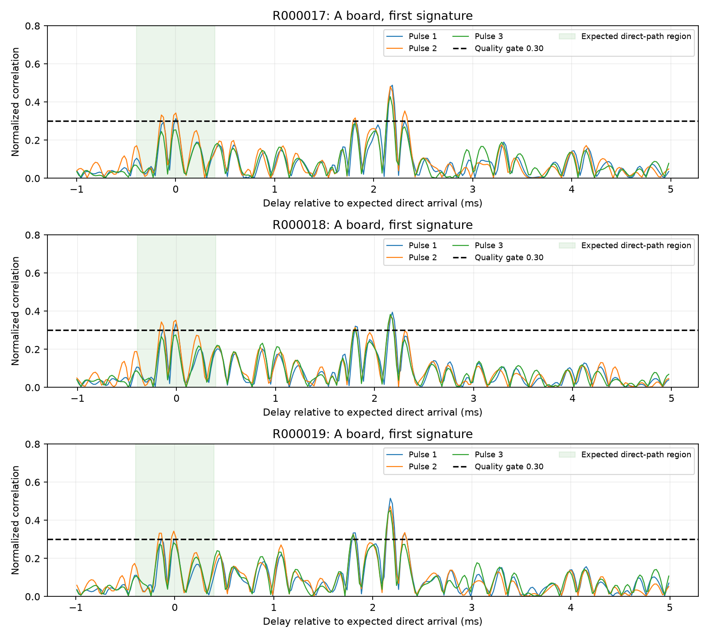

# early1 新算法实测分析

更新日期：2026-09-29。独立记录新算法的实测与后续对照，旧算法及首次移植过程仍见原测试汇总。

## 1. 本轮结论

**R000017～R000019三轮均未得到正确的190 cm统计结果。当前early1还不能作为可靠的验收版本。**

查到三个问题，分别有独立证据：

1. **疑似直达声被入选门限排除。** A板较早到达簇的三脉冲最小相关质量为0.247～0.293，均未达到0.30；最弱的始终为第三脉冲。早到优先只能在已入选候选间选择，无法挽回被前级剔除的峰。
2. **粗筛存在采样相位盲区。** 某些明显有效签名在每9点检查一次的粗筛网格上最高分略低于0.04，漏掉主签名后又对后续混响进行昂贵搜索。
3. **连续失败搜索超过实时预算。** R18 B板两次溢出；R19 A板两次、B板一次溢出。之前只对成功窗口测得约245 ms，未覆盖连续失败路径，负载验证不充分。

仅增加早到优先力度不能解决本轮问题。补充的离线对照显示：降低候选门限并加强早到优先能离开2.65 m回波，但也会产生约1.85 m的旁峰结果，需要继续处理到达簇内部的峰定位。

## 2. 测试条件与数据保全

- 用户确认三轮均为板间190 cm、B侧播放、声源距近端B麦克风50 cm、双屏遮挡，末端物体距远端A板约38.5 cm，与旧190 cm工况一致。
- 路径：声源 → B屏幕 → B麦克风 → A屏幕 → A麦克风 → 末端物体。
- 用户先前说明音量与三者位置有调整，随后确认上述几何条件不变；没有逐轮音量数值/微小姿态记录，不能认定声场逐轮完全相同。
- 用户确认播放前两板已经重新完成同步并显示波形。
- 文件固件标识均为 `547e914+early1`，48 kHz、LEGACY、联合三脉冲、配置温度25°C。
- 原始来源 `H:/R000017`～`H:/R000019`，只读分析，未修改SD卡文件。
- 已备份到 `C:/Users/hhcch/Desktop/SD_capture_verified/2026-09-29_early1_190cm`，并导出双通道WAV、事件、配对及状态日志。
- 六份RNG均通过长度及FNV-1a校验；日志溢出均为0。全部采样锚点epoch为0，相邻DMA时间最大约16.006 ms，选用L通道未见削顶。检测器处理溢出与SD原始录音中断不是一回事：本轮原始录音仍可用于离线分析。

## 3. 板端实际结果

| 轮次 | A/B识别数 | A板接受配对数 | 已配对距离范围 | 最后单次显示 | 最终统计状态 | A/B处理溢出 |
| --- | --- | --- | --- | --- | --- | --- |
| R17 | 15 / 15 | 15 | 2651.7～2653.4 mm | 2653 mm | 超2 m范围；15条成簇 | 0 / 0 |
| R18 | 11 / 8 | 7 | 2650.7～2655.8 mm | 2655 mm | 超2 m范围；7条成簇 | 0 / 2 |
| R19 | 11 / 12 | 8 | 2652.1～2653.9 mm | 2653 mm | 尾日志仍收集中；当前窗口6条 | 2 / 1 |

R19的“总共8次接受配对”和“当前统计窗口6条”不是同一个计数：处理溢出会清空正在进行的统计。R17/R18的最后显示值是单次预览，不是已通过范围检验的统计结果。

三轮共30次板端接受配对均落在约2.65 m，三脉冲跨板一致性仍能通过。**稳定且脉冲间一致，不能证明选中直达声。** R17没有丢样、没有漏事件，也同样全错，已经证明仅解决负载不能解决距离偏差。

### R18录音范围异常

R17/R19每板各16秒；R18 A为12.784秒、B为12.832秒。R18完整离线搜索只能找到11组签名，其时间排列是“1组、间隔2秒、5组、间隔2秒、5组”，与原音频第一段前4组未进入保存范围相符。B首个记录事件的locked为0，unlocked_events为1；其余时间不能据此一概判断未同步。

用户已明确播放前看到了同步完成，因此**不将这个异常直接归因于播放过早**。需后续核查ARM后录音起点、状态重置时序、播放器实际播放起点；文件校验成功和连续锚点只能说明已保存部分完整，不能证明完整15组都被保存。R18按现有11组分析，不按完整15组计算检测成功率。

## 4. 为什么早到优先仍选中回波

根据B板已识别到达时间、保存的时钟映射及190 cm几何延迟，在A录音中定位预期直达区间；这里只用于诊断，不把190 cm输入检测算法。检查该区间约±0.4 ms内满足三脉冲位置一致性的局部峰：

| 轮次 | 较早簇的最小脉冲质量范围 | 相对后方强峰质量 | 达到0.30门限 |
| --- | --- | --- | --- |
| R17 | 0.247～0.275 | 55.9%～63.6% | 0 / 15 |
| R18 | 0.259～0.289 | 65.5%～76.0% | 0 / 11 |
| R19 | 0.257～0.293 | 60.6%～69.3% | 0 / 15 |

41个较早簇中，最弱的均为第三个脉冲；三脉冲位置跨度约0.38～0.82个采样点，时间一致性较好。这里的“质量”是归一化相关系数，不是RMS幅度。

以R17首组为例：

- 较早峰三脉冲质量：**0.313 / 0.343 / 0.254**，第三脉冲不达标。
- 后方强峰：**0.488 / 0.482 / 0.428**，全部通过。
- 两峰相隔约2.177 ms，对应约754 mm附加声程，与1900 mm测成约2653 mm吻合。
- 较早峰相对质量约59.4%，即便只放宽绝对门限，仍低于现行65%相对门限。

约0.75 m额外声程与末端物体约0.385 m的往返路径相近，支持末端反射解释，但不能仅凭时差唯一确定反射面。需要区分物理到达簇与簇内相关旁峰，不能把所有局部峰都解释成不同传播路径。



横坐标以几何预期直达时刻为零；绿色区间为诊断搜索范围。黑虚线是当前0.30门限。约2.2 ms后的三脉冲峰更强。图中波形是相关曲线，不是麦克风原始电压。

## 5. 粗筛与负载：还有一条独立的失败链

### 5.1 不受处理速度限制的回放仍有漏检

| 轮次 | 板上 A/B | 同一C检测器在PC上无限速回放 A/B | 全采样位置FFT搜索 A/B |
| --- | --- | --- | --- |
| R17 | 15 / 15 | 15 / 15 | 15 / 15 |
| R18 | 11 / 8 | 11 / 9 | 11 / 11 |
| R19 | 11 / 12 | 13 / 13 | 15 / 15 |

这区分了两种漏检：C与全位置搜索的差别，来自检测网格/门控；板端与PC C回放的差别，还涉及实时积压、复位、同步状态。不能把全部漏检都说成CPU慢。

检查6个C回放遗漏签名：当前粗筛网格上的最高平方相关分数为 **0.0316～0.0396**，低于0.04；同一附近区间逐采样检查时最高为 **0.244～0.516**。例如R19 B第二组，网格最大0.037566、逐点最大0.515604，完整三脉冲质量约0.665。信号有效，但网格跳过了窄峰。

### 5.2 失败后继续搜索使工作堆积

记录实际C回放的搜索次数和乘累加量：

- R18 B在音频6.368、6.400、6.448、6.512秒对应窗口连续做了4次失败精搜索。144 ms录音跨度内累计约1406万次相关乘累加，按此前板上计时量级约需近1秒；这是估算，不是这些片段的实机耗时测量。
- R19 A仅7.744秒对应的一个16 ms推进窗口就做了两次失败搜索，共687万次乘累加；7.680～7.744秒窗口累计约1408万次。按单个成功搜索约245 ms估算，明显无法即时跟上。
- 板端日志对应地记录了audio_overruns，并有统计计数清空。SD音频仍连续，说明问题在分析消费端。

**单次主循环不长时间阻塞，不代表累计处理能力足够。** 下一版需要防止同一失败区间反复搜索、设置总工作预算，并让粗筛不漏掉主签名。单纯扩大缓冲或降低LCD刷新率不能解决持续超预算。

## 6. “进一步给先到加分”的离线对照

对旧R1～R16和新R17～R19共19轮原始录音，保持三脉冲时间一致性、0.4 ms旁峰合并和原统计规则，比较四种选择规则。检测时不输入真实距离：

| 规则 | 绝对质量下限 | 相对最强质量下限 | R17统计 | R18统计 | R19统计 |
| --- | --- | --- | --- | --- | --- |
| 当前 | 0.30 | 65% | 2652 mm，超范围 | 2654 mm，超范围 | 2652 mm，超范围 |
| 只强化早到优先：合格峰无条件取最早 | 0.30 | 0% | 2652 mm，超范围 | 2654 mm，超范围 | 2652 mm，超范围 |
| 只降低入选下限 | 0.24 | 65% | 2652 mm，超范围 | 1851 mm，9/11成簇 | 2652 mm，超范围 |
| 降低下限并加强早到优先 | 0.24 | 55% | 1852 mm，9/15成簇 | 1851 mm，9/11成簇 | 1897 mm，10/15成簇 |

这些是**无限速FFT离线统计**，不是C板端性能预测。旧15轮已知距离的整轮中心未退化，R12真值仍不明、排除准确度评价。但新R17/R18出现约−48～−49 mm偏差，不能宣称全部修复或达到课程误差要求。

进一步检查：新方案的单次结果分成约1897～1899 mm与1850～1853 mm两簇。B板所选位置没有改变，A板选择的位置相差约0.13～0.14 ms，对应约45～48 mm。这提示同一早到簇内的相关旁峰选择不稳；现有0.4 ms合并虽只保留一个峰，但“按三个脉冲中最弱者的质量决定保留谁”仍可能保留偏早旁峰。

因此用户提出的增强早到优先方向有依据，但应分两级：**先选择可信的早到簇，再在簇内综合三脉冲定位**，不能对每一个局部峰直接奖励“越早越好”。0.24/55%仅为定位问题的对照参数，不能直接作为下一版定值。新数据已被用于选参数，也不能当作独立验证集。

## 7. 下一步建议与本次改动范围

建议按以下顺序修正，不急于继续采更多同条件数据：

1. 修正粗筛相位盲区，使用更可靠的粗定位/局部补搜；不能只降低粗筛门限、继续引入更多混响搜索。
2. 限制失败区间的重复精搜索和累计工作预算；加入失败突发、连续播放的实时负载验证。
3. 调整候选准入与早到优先，保留三脉冲时间一致性约束；同时研究簇内三脉冲综合定位，避免新的约5 cm旁峰偏差。
4. 使用全部旧/新录音、静默区间、噪声和单脉冲干扰对照，再核对C回放与板端连续负载。通过后才进行下一轮实测。
5. R18录音起点及首事件未锁定独立跟踪，不将它作为三轮2.65 m误差的主要解释。

本次完成数据备份、校验、离线分析与新文档；只给离线分析函数增加了可配置质量下限，**未改固件门限、未烧录、未创建Git提交**。开发板仍是early1。

## 8. 结果文件与复现

备份根目录下：

- `R000017`～`R000019/decoded`：WAV及逐项日志。
- `replay/summary.json`：原C检测器回放与全位置搜索；其中真值字段沿用旧脚本映射，新轮真值以本文及diagnostics文件为准。
- `diagnostics/diagnostics.json`：每轮质量、几何预期区间和日志摘要。
- `diagnostics/search_work.json`：逐窗口搜索次数/相关计算量。
- `diagnostics/missed_coarse.json`：6个粗筛漏检签名的网格与逐点最大分数。
- `diagnostics/threshold_comparison.json`：19轮四规则的逐事件与统计结果。
- `diagnostics/provenance.json`：录音与主要分析代码的SHA-256。

诊断图和质量区间可复现：

```powershell
python tools/analyze_early_trials.py 'C:/Users/hhcch/Desktop/SD_capture_verified/2026-09-29_early1_190cm' --rounds 17 18 19 --distance-mm 1900 --output 'C:/Users/hhcch/Desktop/SD_capture_verified/2026-09-29_early1_190cm/diagnostics'
python tools/compare_early_thresholds.py 'C:/Users/hhcch/Desktop/SD_capture_verified/2026-09-29_50cm_source' 'C:/Users/hhcch/Desktop/SD_capture_verified/2026-09-29_early1_190cm' --output 'C:/Users/hhcch/Desktop/SD_capture_verified/2026-09-29_early1_190cm/diagnostics/threshold_comparison.json'
```

`--distance-mm`仅用于定位诊断图的预期直达区间，不参与实际检测或四规则选择。
