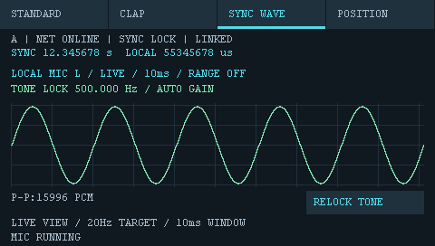

# 实时同步波形 2026-09-29

## 实现

在b09767f触摸UI框架上实现真实L麦克风波形；每板456点、10 ms窗口，目标20 Hz。保留双通道DMA和双板16秒立体声保存，波形页停用测距计算。未修改共享BSP/音频IRQ/缓存策略。

app_range负责只读历史环形PCM、稳健采样时间模型、B到A时间映射与线性插值；app_mic_scope负责公共呈现调度、双缓冲和自动显示增益。读取跨DMA更新/采样缺口时拒绝该帧，避免绘制不一致数据。额外缓冲为一块L声道DMA块及456点显示缓存，复用原有32768点L环形缓冲，不新增整段音频副本。

range_wave.h在A板使用约5秒样本计数/硬件时间回归与迟滞过零估计单音周期（400～600 Hz）。周期单位ps，共同原点为A板ns；采样时基仍由各板持续拟合。以共同周期选择约100 ms前的完整10 ms窗口，不按每板自身零点触发。锁定后冻结声源周期，移动一板不会重新对齐其相位。

WAVE_CLOCK=15共享周期/原点/校准进度，每250 ms发送，检查会话、同步epoch、UI版本和递增包ID。76字节协议，48 kHz版本7，16 kHz版本6；两板必须同时升级。RELOCK TONE复用可靠UI_REQUEST，重置两板校准。日志新增wave_clock(period_ps,origin_master_ns)，解码器已接入。

## 验证

- IAR8.2，48 kHz LEGACY/JOINT2，A/B均0错误0警告。
- 主机显示：实际绘图代码的边界、触摸去抖、四页与公共刷新调度通过；预览为模拟输入，非硬件截图。
- 实际C波形路径：A/B采样率±80ppm、B时钟60ppm及700ms偏移、DMA时间抖动；500.037 Hz音频频率估计、公共窗口插值和移动后相位保留通过。最大波形点误差约61 PCM（输入幅度12000）。验证旧包/错误epoch拒绝、保存忙状态、失锁本地刷新和采样缺口复位。
- 测距C回归16/48 kHz、JOINT2全播放及分数延迟、WIDE通过。用户移除的旧WAV使用HEAD版本在临时目录运行，不恢复或覆盖用户音频文件。
- SD DMA与A/B录制事务、重放及解码回归通过。

## 尚待实测

两屏真实刷新偏差、±2%周期抖动、并排等声程相位一致、移动单板相位变化、失锁与重新收敛和持续负载。先播放500 Hz、保持静止等待TONE LOCK后约1秒，再移动；换声源/频率用RELOCK TONE。20 Hz是调度目标而非已测帧率保证。

## 烧录结果

2026-09-29，两板CSpyBat下载均退出0，驱动启用drv_verify_download，下载后启动运行；尚未观察实际屏幕。

- A：探针`0675FF514966504867230834`，OUT SHA256 `c54d6f828feae0ff79a63a29f6d64df30a006d76265b64bbea612e1d169c85fe`。
- B：探针`0667FF485153826687134138`，OUT SHA256 `b7704f41df662b7ef73670a510e87b7c0cf1cf044cc126ca9980743c063b1e0e`。

## 实机反馈修复：波形/等待提示交替闪烁

用户报告播放正弦波时仍交替显示WAITING。修复历史取帧被任意新DMA块误判失效的问题：改为epoch及环形覆盖范围检查，并将每像素双精度除法改为小范围单精度插值，绝对样本序号保持64位。主循环每隔三块处理时，补消费保留的音频，避免连续性校准反复复位。增加最多200 ms的上帧显示缓冲，持续缺数据仍显示等待。

波形页取消保存提示；USER键和软件保存请求均忽略，其他页面保留原保存功能。底层双通道DMA未更改。

主机测试改为每三次DMA才运行WaveObserve，A/B仍可完成校准、时钟映射及移动相位测试；增加波形页按键及软件保存屏蔽测试，返回标准页按住按键不误触发。实际消除闪烁效果需本次更新后复测。

修复版A/B IAR编译0错误0警告；显示短暂失败保留/200ms超时/恢复测试、波形每三块处理测试、SD保存屏蔽及原录制回归均通过。
修复版A OUT SHA256：`14540c96fafb7a728a8211ba2fbcf4d2e27a46c2cc93a8196797e178c34b10ce`。
修复版B OUT SHA256：`b69962b4968f25e12a28f1c5e7ac36acc69d4c6255b69c70a21cf7adb11481a6`。

用户后续确认修复后完全正常、效果符合预期。已整理[使用说明书](../USER_MANUAL.md)，包含标准测距/DETAILS迁移说明及波形操作、参数和故障现象；量化验收数据未随反馈提供。本次仅整理文档。

## Git检查点

本次提交包含实时同步波形、闪烁修复、针对性测试及使用说明书，作为后续三角定位开发的基线。保留用户工作区内旧测试音删除及新500 Hz音频/生成脚本，不纳入本次功能提交。未推送远端。
