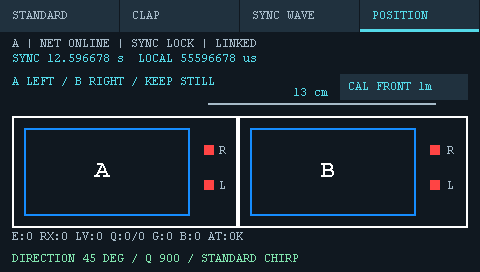
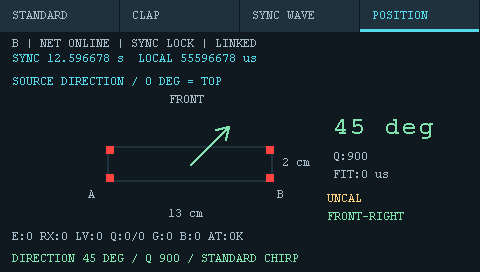

# 四麦方向初版（2026-09-29）

## 用户需求与实现

基线76e946c；两板固定，四麦13×2 cm矩形，声源同平面，专用标准音，不实现击掌。A左B右、R上L下，0°图上方、顺时针。A屏摆放示意/13cm标注/校准入口，B屏矩阵/箭头/八方向文字，身份/网络/同步与结果共享。POSITION禁用USER及软件保存，STANDARD录制保持原流程。

## 数据路径与资源

- `position_dsp.h`：12ms 2～6kHz Hann扫频模板，24kHz等效288点（原始48kHz相邻两点平均）、归一化平方相关、局部峰抛物线细化。双通道阈值0.35，近满量程拒绝，16ms候选峰搜索窗，200ms不应期，播放器周期500ms。
- `app_range.c`：定位页ISR额外将L/R各两点平均存入两个4096点int16环形缓冲，合计16KiB；不做IRQ内相关/绘图。主循环每次最多64个候选起点，复用音频样点时间模型并映射到A时钟，ns为时间单位。模板/峰状态约1.3KiB，临时窗576B，未引入大整段PCM副本。与原共享BSP/Cache/MPU配置无变更。
- 主循环积压时暂缓LCD绘制，环形覆盖/音频epoch变化时放弃旧定位状态。时钟未锁/设置未确认/结果超1.5秒，不给箭头。
- A按事件时间差<2ms配对L/R到达时刻，计算长边/短边平均TDOA。限制同板75us、跨板420us、两短边不一致18us、方向向量模0.70～1.30，使用atan2解方向。模型近似远场，首次测试建议0.5～2m；不输出距离，不继承原测距100mm下限。
- 协议保持76字节，48kHz版本9/16kHz版本8；POSITION仅48kHz可用。新增POSITION_EVENT=16、POSITION_RESULT=17，复用会话/epoch/UI版本校验。B事件、A结果150ms重发，接收按ID去重、不延长旧结果显示期。事件字段L/R为A时钟ns，质量0～1000；结果字段为角度、质量、valid、残差ns、校准状态/计数。两板必须一起更新。
- 校准按钮复用可靠UI请求kind3，A采集8个双板高质量事件。已知源在矩形中心正前方1m，扣除球面传播预测的时差后求三通道相对AL偏置；标准差超过10us或偏置超过80us则失败，不使用偏置。校准状态经结果协议同步。切页/失锁/音频重置清除校准。
- tools/generate_position_audio.py生成48kHz/16bit/mono WAV，默认30s、0.65满量程。未改动用户原500Hz脚本/音频和已删除的旧测试音。

## 验证与限制

主机实际C数据路径八方位模拟通过：1m球面波、A采样+75ppm/B采样−65ppm、B时钟50ppm及700ms偏移，单通道到达时间最大误差约4.3us，A对模拟对端的方向误差<12°（测试阈值，并非实机精度保证）。静默/500Hz单音拒绝、削顶拒绝、时差越界拒绝、旧/错误epoch及UI版本包拒绝、结果过期、已知位置偏置校准与切页清零通过。旧波形/控制/显示及SD录制回归通过。

实际绘图代码的主机模拟预览：

尚待真实四麦通道映射、校准、不同角度、音量/反射及连续负载验证；模板识别/几何检查无法保证拒绝所有反射。2cm短边较敏感，用户要求粗略方向，不承诺精确360°角度。音频与代码仅初版；没有硬件麦克风录音反馈前不声称已通过方向验收。

## 编译、回归与烧录记录

IAR8.2：48kHz LEGACY/JOINT2 A/B均0错误0警告。原16/48k测距完整主机回归（包括WIDE及工作量对比）使用76e946c音频在独立临时目录通过，不恢复用户已清理的音频。生成WAV的采样率、位宽、声道、30秒时长、12ms脉冲/500ms周期已检查。两板已通过原探针分别下载，启用下载校验，两次退出0并启动运行；尚未观察真实定位方向。

- A探针`0675FF514966504867230834`，OUT SHA256 `f42febb37b9e3d5dea46c9dfb3eb06f65978a943741269a6d91dd8360781aeb9`。
- B探针`0667FF485153826687134138`，OUT SHA256 `c10d87b8e143fc754f94f88c0d0f1b03013af3bbcc49798bc5c0814284c35a3c`。

## 首轮实机反馈修复

用户报告刷新不匀、音频不触发、校准0/8短暂出现后消失；照片实际为SYNC LOCK + SETTINGS WAIT。源码可确认处理积压会调用完整PositionReset并清除校准，DisplayReady又会因积压持续拒绝绘图，即使正等待设置ACK也会拒绝。此前主机测试没有模拟处理积压。

- POSITION独立500ms刷新上限（2Hz），STANDARD原200ms及WAVE50ms保持。定位绘图不再被积压准入条件无限延期。
- 静默窗口先做低成本RMS筛选，每64采样粗步进，有足够音量才进入40ms全分辨率相关搜索；单次主循环定位计算约1.5ms时间预算（以候选为粒度），给网络/触摸/设置重传留出调度机会。
- 模板只生成一次。积压仅重启消费位置/峰状态，不清除校准请求与已收集的样本；真实音频epoch变化重启校准样本，但保留校准请求。完整UI/同步重置仍清除校准。
- 未校准的同板时差接纳范围允许硬件偏置（检测约167us、收包175us），最终几何判断仍使用校正后75us上限，避免尚未校准就拒绝可校准通道偏置。
- IAR原工程优化级别为低；只为app_range.c配置高优化，避免改变共享HAL/BSP/网络驱动编译设置。IAR8.2函数pragma不能提升默认优化级别，因此使用EWARM/ranging_bsp.ewp文件级配置，角色构建脚本继承此配置。
- 增加E/RX/LV/QL/QR/D/AT本板诊断行，区分WAIT FOR SETTINGS ACK与WAIT FOR CLOCK SYNC。实际播放输入和硬件CPU耗时尚未直接采集，不能将不触发的全部原因认定为已经查清；后续可据诊断分离信号、检测、配对问题。

新增回归：积压恢复保留校准、真实音频缺口保留请求但重新收集、ACK等待时UI仍可绘制、定位页500ms呈现节奏；八方位检测、校准及旧波形/网络控制测试通过。专用音频未改动。

修复版IAR8.2 A/B完整重编译均0错误0警告，随后两板均已下载校验成功（退出0并启动运行）。双通道临时窗由576B增至1152B。更新后实际播放触发仍需用户复测，未声称已通过硬件定位。
- 修复版A OUT SHA256：`637e93c46b065893d5d962d9e967caafab58f87c8dc01a12947eaf0006a45c70`。
- 修复版B OUT SHA256：`5157446a5f5220e5a24dfc6ff5b96ee2ad5b9aedf8d7a63bac94f90962960fba`。

## 第二轮实机反馈：高相关但E=0

照片IMG_0143/0144：A为LV695、Q942/956、D22，B为LV1503、Q916/912、D29，均E0/RX0、AT OK、SYNC LOCK/LINKED；用户报告静默期间D也不断增长。说明两通道都出现过强模板匹配，但还没有发布完整事件，不能归因于音量不足。

第一轮降载只靠RMS门控，背景噪声超过32 PCM RMS时仍退化为全采样逐点相关，且峰搜集还要等待16ms。改为八采样步进的正交双模板粗搜索（sin/cos能量，避免纯sin载波过零漏检），命中后回退16点进行96点全分辨率细搜索，达到首个有效峰后2ms完成事件。正式质量、校准和几何判断门限不降低；粗筛0.08只负责启动细搜索。模板额外增加288个float（1152B）。

诊断D拆成G（epoch变化）/B（消费积压或覆盖）。保持POSITION 2Hz、1.5ms计算片预算和校准状态恢复规则。音频文件未改动。

新增测试：背景随机噪声RMS约70（高于门控阈值），每次16ms DMA只执行一次PositionProcess（原测试执行14次），八方向均检出2个事件且B积压计数0；64种粗网格亚采样相位均可启动细搜索。结合已有通道时钟漂移、球面波、校准、UI、旧波形等回归。测试证明受限调用频率下的算法进度，尚不等同真实MCU计时/房间反射验证。

同时修复细搜索末尾已激活的峰被下一轮粗筛清除的问题，新增专门边界回归通过。第二轮修复版A/B编译0错误0警告；已分别烧录、启用下载校验且均退出0并启动运行。实际音频复测待用户反馈。
- 第二轮修复A SHA256 `ca9aefd48a560795de8b492c206ffefa43fed2e9775bacc3afb451cc4fc71d0b`。
- 第二轮修复B SHA256 `59a8c77bbdd0aa786bf17146f78f97b560ab3ec258fa466a08a434d9fc699d3b`。

## 实机定向通过后的几何修正

用户反馈定位效果较好、角度基本准确，但关于13cm长边前后镜像，确认上下麦克风L/R定义与此前相反。保持PCM通道、STANDARD和SYNC WAVE使用的L不变，仅将定位坐标改为L上/R下：AL(-65,+10)、AR(-65,-10)、BL(+65,+10)、BR(+65,-10)，单位mm；反转方向求解的短边时差符号，A屏孔位标签同步修改。

按用户要求将校准位置由四孔中心正前方1m改为50cm。参考声程差改为sqrt(65mm²+510mm²)−sqrt(65mm²+490mm²)，相对AL，AR/BR为正差、BL为0。按钮和使用说明书更新为CAL FRONT 50cm。仍采集8个事件，旧校准重启后清除，需要按新位置重新校准。

50cm/镜像修正版八方向及校准回归通过，A/B编译0错误0警告；已分别烧录，两次校验下载退出0并启动运行。软件通道L/R采用实测映射，避免与板上丝印混同。
- 50cm版本A SHA256 `c7176116590de0f3e24d6e94164d507f6d01a482fb7e7e280a90040dbbdfe227`。
- 50cm版本B SHA256 `0bcfb264abc9c9522b797da0d5306a6b56436a051f533bbdf8ad588b09276ffc`。

用户追加“可以的话加cm距离”。已评估球面TDOA：正前方50cm到100cm仅0.3603us变化，45度方向两短边差从7.4712us到3.7483us，90度方向长边仅约0.0575us变化。当前数us级检测误差不足以保证全方位稳定距离，未加入误导性的数值估计；专用音频不变。

## 静默积压优化与负载诊断

用户照片：60秒静默两板E0/G0/B35；播放后A E51 RX50 B53，B E50 RX49 B54，两板16°/Q782。说明无静默误触发，但仍持续积压；尚无实机耗时数据，不把绘屏或单个函数认定为唯一根因。

本轮将粗筛环形缓冲搬运、独立能量计算及正交相关合并为一次直接遍历，细搜索才复制窗口；仅在历史电平/质量峰值更新时计算平方根。保留8点粗步进、96点细搜索、2ms峰收集、所有门限和专用音频，粗筛增加DMA覆盖/epoch检查。无新增ISR计算，不改变DMA/cache/时钟/协议。新增LAG/DSP/LCD历史最大值（ms/us/us），占12字节状态，显示于244～251像素Font8行；保持2Hz刷新。

验证：A/B主机回归通过，含80组带DC/噪声/削顶的跨环边界相关等价测试，各60秒模拟噪声E0/B0，八方向到达时刻/方向/校准、触摸调度、旧同步波形。主机测试不模拟MCU指令耗时，不能代替实机积压验收。A/B IAR构建均0错误0警告。

已分别烧录A（67230834）和B（87134138），启用下载校验，两次退出0并启动运行。实机静默60秒及全音频复测待用户完成。
- 本轮A OUT SHA256 `f4588623088bb2dffd6c6c33c50c8ff031d4c5543d7be87b1db575ffb1116901`。
- 本轮B OUT SHA256 `b1a3d2674afbe1042dcca3bd3707aecf02485c869229f743594071de281ae9a4`。

## 诊断字号调整

按用户反馈将LAG/DSP/LCD改为与原诊断相同的Font12，两行位置225/239，底部提示253；A摆放图高度减少12像素，删除原先被诊断覆盖的冗余文字。A/B实际绘图代码生成的预览确认无重叠，现有回归通过，IAR两板0错误0警告。两板已校验烧录并启动。
- A SHA256 `b505543b294b21d5caeca1513d6135bf1908a5964cebb76e70f6836252eb51d2`。
- B SHA256 `24bf017595653ccd84b89bb450819a336470e7db472f8fdc2a86317cbf6293b0`。

## 用户验收与定位检查点

用户确认定位效果已达到预期。最终实测154/155/156：静默60秒E为0/0、G为0/0、B为1/0；启动校准并播放第一轮后E为56/58，CAL OK，B为1/1；第二轮后E为115/118（新增59/60），B仍1/1，G仍0/0，两板0°/Q808、FIT1us。校准会重置统计，静默与首轮不能直接作累计差值。第二轮LAG最大65/78ms，DSP约3.2/3.3ms，LCD约31/36ms。当前作为粗方向功能验收检查点；未宣称全方位量化精度或距离估计通过。下一项为独立CLAP击掌测距。
